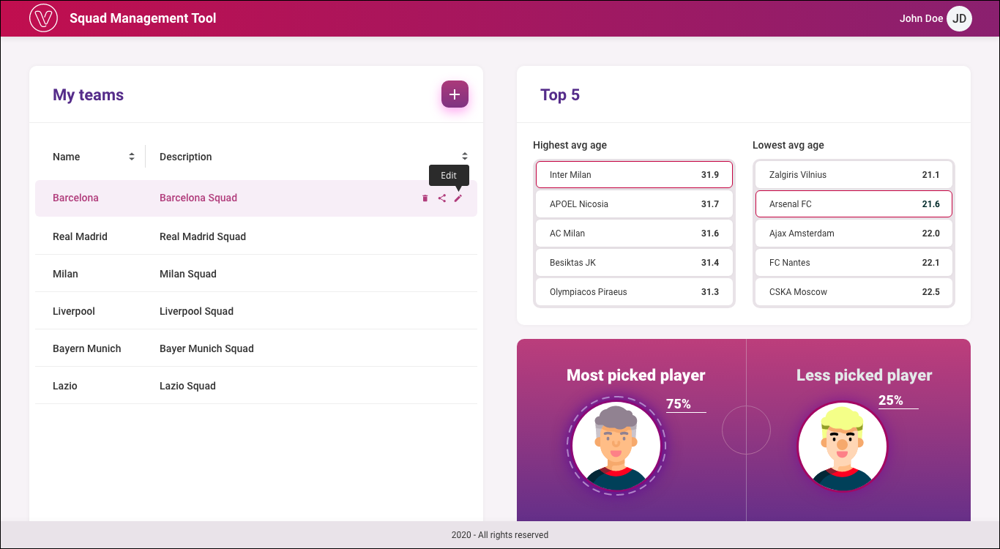
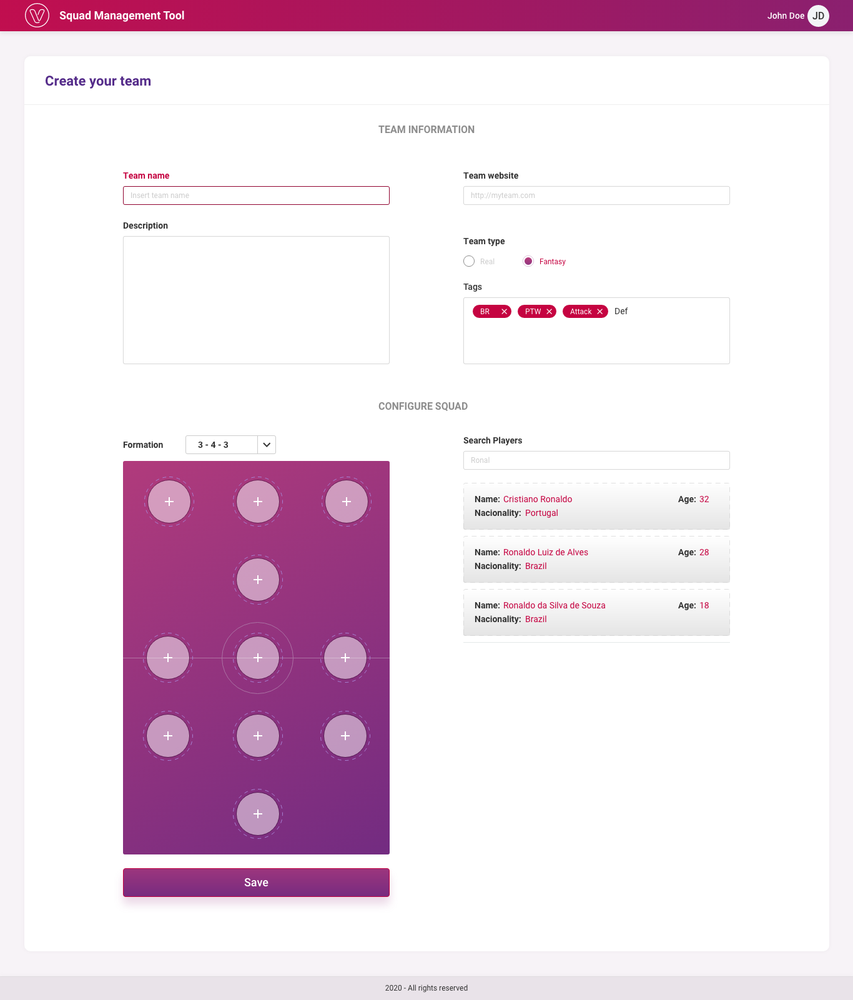

<h4 align="center"> 
	Venturus
</h4>
<h4 align="center"> 
	🚧  Status: In progress (the work is paused because deadline )
</h4>

<p align="center">
 <a href="#-sobre-o-projeto">About</a> •
 <a href="#-funcionalidades">Features</a> •
 <a href="#-layout">Layout</a> • 
 <a href="#-como-acessar-o-projeto">How to access</a> • 
 <a href="#-como-executar-o-projeto">How it works</a> • 
 <a href="#-tecnologias">Technologies</a> • 
 <a href="#-autora">Author</a> • 
 <a href="#user-content--licença">License</a>
</p>

## 💻 About

Web application Squad Management Tool Venturus.

---

## ⚙️ Features

Phase 1

1. Implement Page Layout.

- [x] 1.1Create placeholders for non implemented features.

2. Implement "My teams" section.

- [x] 2.1 There is no need to implement Share action
- [x] 2.2 User must be able to sort by name and description.

3. Ability to Create/Edit and Remove a team.

- [x] 3.1Team information section only.

  - [x] 3.1.1 All fields but description and tags are mandatory.
  - [x] 3.1.2 Default value is empty for all fields.
  - [ ] 3.1.3 Team website must validate site URL.
  - [ ] 3.1.4 You must highlight fields/labels whenever user tries to create/update a team with invalid information.
  - [x] 3.1.5 Current UI is displaying Team name as an example of an invalid field.
  - [x] 3.1.6 For tags field user must be able to enter a free text and tag will be created as soon as the user hits enter or semicolon.

  4.Ability to see what player was the most/less picked on.

- [] 4.1 Replace images by player initials.

Phase 2

- [x] 1.  Ability to search for a player name and see the list of players who matched the criteria.

- [ ] 2. Ability to add a player to a field position through drag n drop.

· Once a player was added to the team, it should be disabled on search result list.

· Whenever a user is added to a position, it's initials must be displayed. i.e. Cristiano Ronaldo (CR) / Zinedine Yazid Zidane (ZZ)

- [ ] 3. Save must store the team's players into application state.

Phase 3

- [x] 1.  Implement "Top 5" section to the dashboard.

  - [] 1.1 Whenever user clicks on a given team, it should open team configuration page.

- [x] 2. Ability to configure and display a given formation from the list (Soccer field must display the positions accordingly). Options:

3 - 2 - 2 - 3
3 - 2 - 3 - 2
3 - 4 - 3
3 - 5 - 2
4 - 2 - 3 - 1
4 - 3 - 2 - 1
4 - 3 - 3
4 - 4 - 2
4 - 5 - 1
5 - 4 -1

- [ ] Whenever a formation is changed all current players must be removed.

- [ ] 3. Ability to see player information on hover (soccer field

---

## 🎨 Layout

  
  

---

## :runner: How to access

### This project is deployed on Vercel [Vercel](https://rpc-manuhon99.vercel.app/)

---

## 🚀 How to execute

This project is a Frontend website. The data is get from API Data Football free account.

### Pre-requisites

Before you begin, you will need to have the following tools installed on your machine: [Git] (https://git-scm.com), [Node.js] (https://nodejs.org/en/). In addition, it is good to have an editor to work with the code like [VSCode] (https://code.visualstudio.com/)

Running the web application (Frontend)

```bash

# Clone this project
$ git clone https://github.com/manuhon99/venturus-1.0.0.git

# Access the folder
$ cd venturus

# Install the dependencies
$ npm install

# Execute
$ npm run dev

# The application will be load on port:3000 - http://localhost:3000
```

---

## 🛠 Tech Stack

The following tools were used in the construction of the project:

- [NextJS](https://nextjs.org/)
- [Figma](https://www.figma.com/)
- [Football API](http://api.football-data.org/)
- [Visual Studio Code](https://code.visualstudio.com/)
- [Postman](https://www.postman.com/)

---

## :superhero_woman: Author

<br/> [](https://www.linkedin.com/in/emanueli-santos-da-silva-66a76525/) [](mailto:emanuelissilva@hotmail.com)

---

## 📝 Licença

[MIT](./LICENSE).

---
